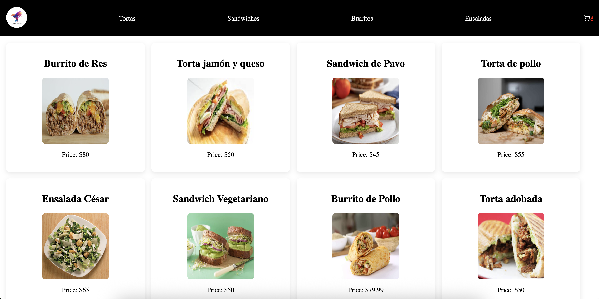

# Tienda en Línea - E-commerce React App

Una aplicación de e-commerce desarrollada con React, Vite y Firebase que permite a los usuarios navegar productos, agregar al carrito y realizar compras.



## 🚀 Demo en Vivo

La aplicación está desplegada y disponible en: [https://code-73870.vercel.app/](https://code-73870.vercel.app/)

## 📋 Características

- ✅ Catálogo de productos con navegación por categorías
- ✅ Carrito de compras con funcionalidad completa
- ✅ Proceso de checkout y confirmación de órdenes
- ✅ Integración con Firebase para almacenamiento de datos
- ✅ Diseño responsive y moderno
- ✅ Routing con React Router DOM
- ✅ Estados de carga con spinners
- ✅ Alertas y notificaciones con SweetAlert2

## 🛠️ Tecnologías Utilizadas

- **Frontend**: React 19.1.0, Vite 7.0.3
- **Routing**: React Router DOM 7.7.1
- **Base de Datos**: Firebase 12.1.0
- **Estilos**: CSS modules, React Icons 5.5.0
- **UI/UX**: React Spinners 0.17.0, SweetAlert2 11.22.4
- **Herramientas**: ESLint para linting

## 📦 Instalación

### Prerrequisitos

- Node.js (versión 16 o superior)
- npm o yarn
- Cuenta de Firebase (para la base de datos)

### Pasos de Instalación

1. **Clona el repositorio**
   ```bash
   git clone https://github.com/tovar-dev/code-73870.git
   cd code-73870
   ```

2. **Instala las dependencias**
   ```bash
   npm install
   ```

3. **Configura Firebase**
   - Crea un proyecto en [Firebase Console](https://console.firebase.google.com/)
   - Configura Firestore Database
   - Copia las credenciales de configuración
   - Actualiza el archivo `src/service/Firebase.jsx` con tus credenciales

4. **Variables de entorno (opcional)**
   - Crea un archivo `.env` en la raíz del proyecto
   - Agrega tus variables de Firebase si las necesitas

## 🚀 Ejecución en Desarrollo

Para ejecutar la aplicación en modo desarrollo:

```bash
npm run dev
```

La aplicación estará disponible en `http://localhost:5173`

## 📝 Scripts Disponibles

- `npm run dev` - Ejecuta la aplicación en modo desarrollo
- `npm run build` - Construye la aplicación para producción
- `npm run preview` - Previsualiza la build de producción
- `npm run lint` - Ejecuta ESLint para verificar el código

## 🏗️ Build para Producción

Para crear una versión optimizada para producción:

```bash
npm run build
```

Los archivos optimizados se generarán en la carpeta `dist/`.

## 🌐 Despliegue

### Despliegue en Vercel

1. **Instala Vercel CLI**
   ```bash
   npm install -g vercel
   ```

2. **Inicia sesión en Vercel**
   ```bash
   vercel login
   ```

3. **Despliega la aplicación**
   ```bash
   vercel
   ```

4. **Para despliegues posteriores**
   ```bash
   vercel --prod
   ```

### Despliegue Automático

El proyecto está configurado para despliegue automático en Vercel. Cada push a la rama principal triggerea un nuevo despliegue.

### Otras Plataformas

También puedes desplegar en:
- **Netlify**: Conecta tu repositorio y configurarás el build command como `npm run build`
- **GitHub Pages**: Usa GitHub Actions para desplegar automáticamente
- **Firebase Hosting**: Usa `firebase deploy` después de configurar Firebase CLI

## 📁 Estructura del Proyecto

```
src/
├── components/           # Componentes reutilizables
│   ├── Cart/            # Componentes del carrito
│   ├── Checkout/        # Proceso de compra
│   ├── ItemDetail/      # Detalles del producto
│   ├── ItemListContainer/ # Lista de productos
│   ├── NavBar/          # Barra de navegación
│   └── ...
├── context/             # Context API para estado global
├── hooks/               # Custom hooks
├── libs/                # Librerías y utilidades
├── service/             # Servicios (Firebase, APIs)
├── mock/                # Datos de prueba
└── utils/               # Utilidades generales
```

## 🔧 Configuración de Firebase

1. Crea un proyecto en Firebase Console
2. Habilita Firestore Database
3. Configura las reglas de seguridad
4. Actualiza `src/service/Firebase.jsx` con tu configuración:

```javascript
const firebaseConfig = {
  apiKey: "tu-api-key",
  authDomain: "tu-project.firebaseapp.com",
  projectId: "tu-project-id",
  // ... resto de la configuración
};
```

## 🤝 Contribución

1. Fork el proyecto
2. Crea una rama para tu feature (`git checkout -b feature/AmazingFeature`)
3. Commit tus cambios (`git commit -m 'Add some AmazingFeature'`)
4. Push a la rama (`git push origin feature/AmazingFeature`)
5. Abre un Pull Request

## 📄 Licencia

Este proyecto está bajo la Licencia MIT. Ver el archivo `LICENSE` para más detalles.

## 👨‍💻 Autor

**Oswaldo Tovar**
- GitHub: [@oswaldotovar32](https://github.com/oswaldotovar32)

## 📞 Soporte

Si tienes alguna pregunta o problema, por favor abre un issue en este repositorio.

---

⚡ Construido con React + Vite para una experiencia de desarrollo rápida y moderna